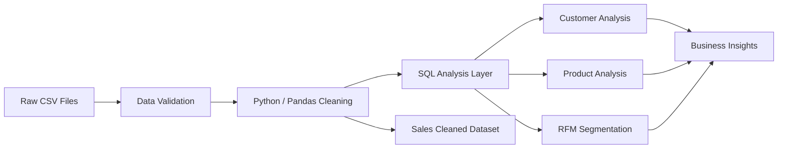
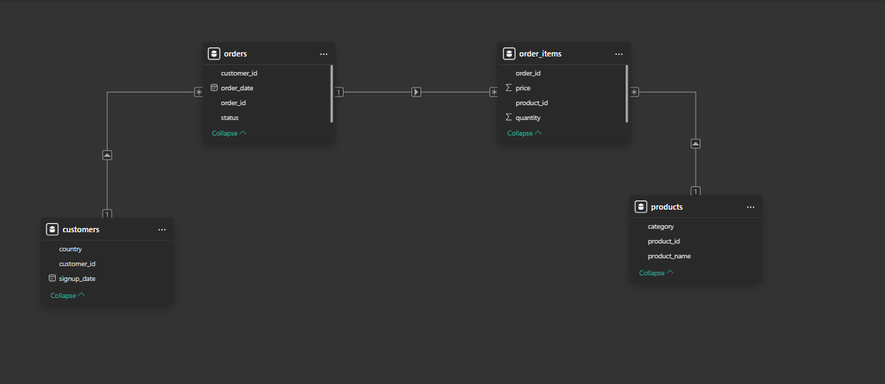

# Kegel Sales Project


A data analytics project focused on e-commerce sales, customer behavior, product performance, and revenue quality. The goal is to turn raw transactional data into actionable insights using Python, SQL, and notebook-based exploratory analysis.

## Overview

This project analyzes a retail/e-commerce dataset composed of:

- customers
- products
- orders
- order items
- a cleaned sales dataset

The analysis supports business questions such as:

- Which customers generate the highest revenue?
- Which products perform best by volume and value?
- What are the main sales and order trends over time?
- Which orders should be included in valid revenue calculations?
- How can RFM segmentation help with targeted customer retention strategies?
- What data quality issues need to be addressed before reporting?

## Business objective

> How can an e-commerce company increase revenue and improve retention by understanding customer purchasing behavior, product demand, and order quality?

## Dataset overview

| File | Description |
| --- | --- |
| `Data/customers.csv` | Customer master data |
| `Data/products.csv` | Product catalog |
| `Data/orders.csv` | Order header data |
| `Data/order_items.csv` | Line-level product purchases |
| `Data/sales_cleaned.csv` | Flattened analytical dataset ready for reporting |

### Core relationships

- `customers.customer_id` → `orders.customer_id`
- `orders.order_id` → `order_items.order_id`
- `products.product_id` → `order_items.product_id`

This relational structure allows for both transactional and aggregated analysis.

## Repository structure

```text
Kegel_sales_project/
├── Data/
│   ├── customers.csv
│   ├── products.csv
│   ├── orders.csv
│   ├── order_items.csv
│   └── sales_cleaned.csv
├── Docker_Files/
│   └── docker-compose.yml
├── Results/
│   └── ER_Diagram.png
├── SQL/
│   ├── customer_analysis.sql
│   ├── data_quality_analysis.sql
│   ├── product_analysis.sql
│   ├── rfm_analysis.sql
│   └── sales_analysis.sql
├── analysis.ipynb
├── readme.md
├── TODO.md
└── .gitignore
```

## Project architecture



## Installation and setup

### 1. Clone the repository

```bash
git clone https://github.com/your-username/Kegel_sales_project.git
cd Kegel_sales_project
```

### 2. Create a virtual environment

```bash
python -m venv .venv
```

On Windows:

```bash
.venv\Scripts\activate
```

On macOS/Linux:

```bash
source .venv/bin/activate
```

### 3. Install dependencies

```bash
pip install pandas numpy matplotlib seaborn jupyter
```

If you are using PostgreSQL locally or in Docker, make sure the database client and SQL tooling are available.

### 4. Run the notebook

```bash
jupyter notebook
```

Then open `analysis.ipynb` and begin the exploratory workflow.

### 5. Run SQL analysis

You can execute the SQL scripts in the `SQL/` folder against a PostgreSQL database or a local analytics environment.

### 6. Docker setup

The project includes Docker configuration for environment consistency:

```bash
docker-compose -f Docker_Files/docker-compose.yml up
```

## Data quality findings

The project already identifies several important issues worth tracking:

- 15 customers do not have any orders.
- 285 customers have at least one order.
- All order items are linked to valid orders.
- All order items are linked to valid products.
- Duplicate order IDs exist in the order-items dataset.
- No null values were found in the primary datasets.

These insights are essential because data quality directly affects revenue reporting, customer segmentation, and product analysis.

## Business rules used in the analysis

1. Only completed orders are considered valid for completed sales analysis.
2. Revenue is calculated from the sale value associated with completed transactions.
3. Average Order Value (AOV) is calculated as total revenue divided by the number of completed orders.
4. Duplicate or inconsistent records must be reviewed before reporting business performance.

## SQL analysis files

The project includes dedicated SQL scripts for targeted insight generation:

- `SQL/data_quality_analysis.sql` — data validation, null checks, duplicates, and relationship audits
- `SQL/customer_analysis.sql` — customer-level behavior and segmentation analysis
- `SQL/product_analysis.sql` — product performance and contribution analysis
- `SQL/rfm_analysis.sql` — recency, frequency, and monetary customer scoring
- `SQL/sales_analysis.sql` — revenue trends, order performance, and sales metrics

## Notebook workflow

The notebook `analysis.ipynb` is used to:

- inspect raw datasets
- validate relationships and schemas
- check duplicate and missing data patterns
- clean or normalize the data
- calculate summary KPIs
- prepare findings for SQL and reporting workflows

## Screenshots and outputs

This section highlights visual outputs and dashboard artifacts created from the project.

### ER diagram



### Dashboard output placeholders

The team can add screenshots of the following after generating them:

- sales dashboard
- product performance dashboard
- RFM segmentation dashboard
- KPI summary dashboard

## Final business insights summary

The expected value of this project is to identify the drivers of revenue and customer retention. Based on the analysis approach and initial findings, the final business story should focus on:

- identifying the highest-value customer groups
- highlighting products with the strongest sales contribution
- measuring revenue quality based on completed transactions only
- detecting customer churn or low-engagement segments through RFM patterns
- improving business decisions by cleaning and validating the core sales data

In practical terms, this project can help answer:

- Who are the most valuable customers?
- Which products should be prioritized in marketing and inventory planning?
- What sales patterns deserve action from the business team?
- Which issues in data quality could distort strategic decisions?

## Tools and technologies

- Python
- Pandas
- NumPy
- Matplotlib
- Seaborn
- Jupyter Notebook
- PostgreSQL / SQL
- Docker

## How to use this project

1. Open the data files in `Data/`.
2. Review the exploratory analysis in `analysis.ipynb`.
3. Run the SQL scripts in `SQL/` for structured analytics.
4. Use `sales_cleaned.csv` as the analysis-ready dataset for quick queries.
5. Compare Python findings with SQL output to validate business conclusions.

## Conclusion

This project demonstrates a complete analytics workflow: data validation, relational modeling, exploratory analysis, SQL-based reporting, and business insight generation. It is designed as a practical e-commerce analytics portfolio project that transforms raw order data into actionable strategic guidance.


